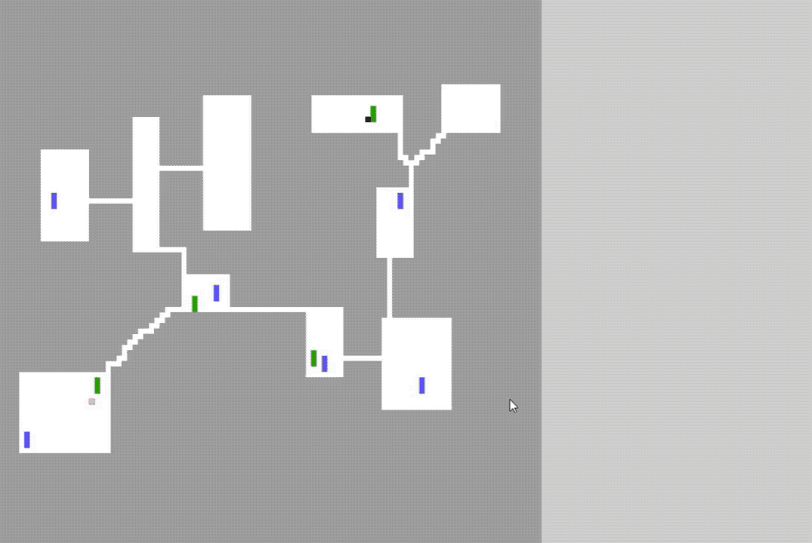

# DungeonAIProject

AI battle simulation.
2 figures (black and red) need to find each other, fight, collect ammo and health.
Each figure has its own behavior, and according to that they are making decisions about the next move, weather to search for medicine or ammo or enemy.

During a battle each figure can decide weather to retreat and find medicine or ammo, or keep pushing and fighting.
No combat in the "tunnels" between the rooms (white rectangles).

The Search is based on A* search.

Implemented with C++ and OpenGL.

## Board view

